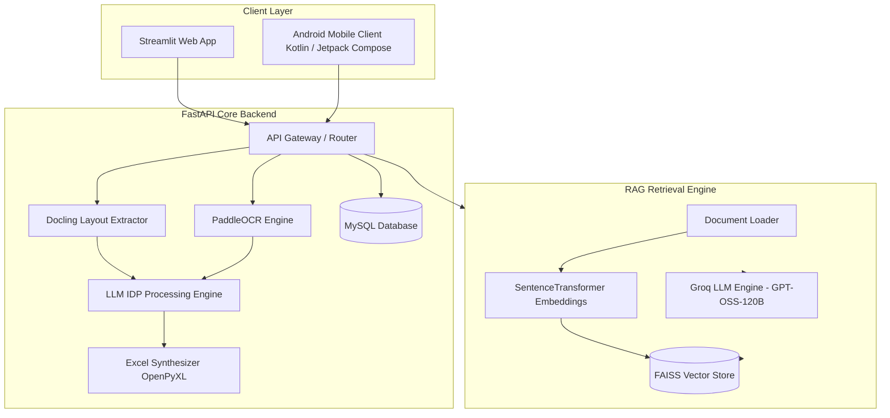

# YellowDoc.ai

An Enterprise Intelligent Document Processing (IDP) and Financial Retrieval-Augmented Generation (RAG) Platform.

YellowDoc.ai automates the extraction, structuring, and analysis of complex financial documents—including tax invoices, receipts, bills, bank statements, and audited financial records. By integrating advanced optical layout analysis, Large Language Models (LLMs), automated spreadsheet generation, and vector retrieval, YellowDoc.ai converts unstructured document files into deterministic, machine-readable Excel workbooks and provides conversational context-aware query capabilities.

---

## Architecture Overview

YellowDoc.ai operates on a dual-interface architecture backed by a high-performance FastAPI microservice layer, intelligent layout parser, and document vector database.



---

## Key Features

- Automated PDF-to-Excel Conversion: Converts scanned or digital financial documents (invoices, receipts, tax statements) into multi-sheet structured Excel workbooks.
- Layout and OCR Extraction: Powered by IBM Docling and PaddleOCR for tabular structure analysis, text extraction, and layout-preserving Markdown transformation.
- Deterministic LLM Structuring: Utilizes fine-tuned system prompting with Groq/LangChain LLM backends to output validated JSON models representing worksheets, headers, rows, and cells without data hallucination.
- Financial Retrieval-Augmented Generation (RAG): Indexes processed document content into a FAISS vector index utilizing SentenceTransformers (`all-MiniLM-L6-v2`) for context-bounded query processing.
- Conversational Document Q&A: Enables direct natural language inquiries over document stores with exact extraction of totals, vendor names, dates, tax line items, and line item calculations.
- Multi-Platform Support: Features a web application (Streamlit) alongside a native Android client (Kotlin + Jetpack Compose Material 3 UI).

---

## Detailed Processing Workflow

```
[ Input PDF / Image Document ]
              │
              ▼
[ Layout Analysis & OCR (IBM Docling / PaddleOCR) ]
              │
              ▼
[ Structured Markdown Generation ]
              │
              ▼
[ LLM IDP Transformation (JSON Validation Engine) ]
              │
              ▼
    ┌─────────────────────────┴─────────────────────────┐
    │                                                   │
    ▼                                                   ▼
[ Excel Synthesis (.xlsx) ]             [ Document Vectorization ]
    │                                                   │
    ▼                                                   ▼
[ User File Download ]                   [ FAISS Vector Store Index ]
                                                        │
                                                        ▼
                                         [ RAG Context Retrieval & Q&A ]
```

### Phase 1: Document Parsing & Layout Extraction
1. The user submits a document (PDF or image file) via either the Web UI or Mobile Client.
2. The document is ingested by the extraction pipeline:
   - IBM Docling identifies layout boundaries, table borders, headings, metadata blocks, and body paragraphs, outputting document structure as Markdown.
   - PaddleOCR executes optical character recognition for image-based or low-quality scanned documents.

### Phase 2: LLM Structuring & JSON Synthesis
1. The extracted Markdown is passed to the LLM Intelligent Document Processing (IDP) engine.
2. Controlled system prompts enforce strict deterministic parsing rules:
   - Output must strictly adhere to the target JSON schema.
   - Spelling, exact numbers, punctuation, and ordering are preserved without alteration.
   - Missing fields are populated with standard empty structures rather than null values.
3. The resulting JSON payload represents the target workbook configuration, including sheet names, column dimensions, cell content, and formatting rules.

### Phase 3: Excel Generation
1. The backend Excel generation module receives the JSON payload.
2. OpenPyXL dynamically builds an Excel workbook, populating worksheets, header formatting, numeric formats, and grid alignments.
3. The generated `.xlsx` file is persisted and made available for immediate direct download or mobile export.

### Phase 4: Vector Indexing & RAG Retrieval
1. Extracted document text is chunked into semantic segments via the Document Loader.
2. Embeddings are generated using the `all-MiniLM-L6-v2` SentenceTransformer model.
3. High-dimensional vector representations are indexed in a local FAISS vector store.
4. When a query is issued:
   - Similarity search retrieves top matching document contexts.
   - The query and retrieved context are supplied to the Groq LLM endpoint (`openai/gpt-oss-120b`).
   - The model generates a structured, context-bound response detailing answers, source references, and confidence flags.

---

## System Requirements

- Operating System: Linux / macOS / Windows 10+
- Python: Version 3.10 or higher
- Database: MySQL Server 8.0+
- Java Development Kit (JDK): JDK 17 (for Android client compilation)
- Android Studio: Version 2024.1+ (for mobile app compilation)

---

## Directory Structure

```
YellowDoc.ai/
├── backend/                        FastAPI backend implementation
│   ├── auth/                       Authentication modules and security handlers
│   ├── data/                       Data Access Layer and repositories
│   ├── db/                         Database connection logic and SQLAlchemy models
│   ├── docling_processing/         IBM Docling integration for layout parsing
│   │   ├── json_extractor.py       Docling JSON parser
│   │   └── markdown_extractor.py   Docling Markdown layout extractor
│   ├── document_processing/        PaddleOCR and document parsing utilities
│   ├── dto/                        Data Transfer Objects and Pydantic schemas
│   ├── excel/                      OpenPyXL Excel generation service
│   ├── llm/                        LLM orchestration engines and system prompts
│   │   ├── json_response.py        JSON response formatter
│   │   ├── llm_model.py            LangChain/Groq model integration
│   │   └── system_message.py       IDP system prompt definitions
│   ├── repo/                       Database repository implementations
│   ├── router/                     API routes (Excel router, Query router, User router)
│   ├── services/                   Business logic service layer
│   └── main.py                     FastAPI application entry point
├── frontend/                       Streamlit web interface
│   ├── app.py                      Streamlit dashboard entry point
│   ├── config.py                   Frontend configuration settings
│   ├── excel_generator.py          Web client excel generation helper
│   └── rag_service.py              RAG backend integration service
├── RAG/                            Retrieval-Augmented Generation module
│   ├── data_loader.py              Document loader and chunking service
│   ├── embeddings.py               SentenceTransformers embedding engine
│   ├── search.py                   FAISS search and Groq RAG integration
│   ├── structured_response.py      Structured Pydantic response schema
│   └── vector_store.py             FAISS index management service
├── android/                        Native Android Mobile Client
│   ├── app/src/main/java/com/yellowdoc/app/
│   │   ├── MainActivity.kt         Main application activity
│   │   ├── YellowDocApplication.kt Application class definition
│   │   ├── core/                   DataStore config, Retrofit network modules
│   │   ├── data/                   Repositories, APIs, models, download manager
│   │   └── ui/                     Jetpack Compose screens and design system
│   └── build.gradle.kts            Android Gradle configuration
├── assests/                        System screenshots and asset files
├── faiss_store/                    Local FAISS vector store database files
├── docs/                           Sample PDF documents and json outputs
├── requirements.txt                Python package dependencies
├── .env                            Environment configuration template
└── README.md                       Project documentation
```

---

## API Endpoints Specification

### Document & Excel Operations

| Method | Endpoint | Description | Query / Body Parameters |
|---|---|---|---|
| POST | `/excel/generate` | Processes uploaded PDF document and generates an Excel spreadsheet | `file`: Multipart PDF upload<br>`excel_filename`: String |
| GET | `/excel/download/{filename}` | Streams generated `.xlsx` workbook for download | `filename`: Path parameter |

### Retrieval & Query Operations

| Method | Endpoint | Description | Query / Body Parameters |
|---|---|---|---|
| POST | `/query` | Executes RAG similarity search and generates structured answer | `query`: String |

### Health Check

| Method | Endpoint | Description | Response |
|---|---|---|---|
| GET | `/` | Returns system version and health metadata | `{ "API": { "application": "YellowDoc.ai", "version": "1.0.0" } }` |

---

## Installation and Setup Guide

### 1. Repository Setup

Clone the repository and navigate to the project root directory:

```bash
git clone https://github.com/Manabendu-ai/YellowDoc.git
cd YellowDoc
```

### 2. Virtual Environment Setup

Create and activate a Python virtual environment:

```bash
python3 -m venv venv
source venv/bin/activate
```

On Windows:

```cmd
venv\Scripts\activate
```

### 3. Environment Configuration

Create a `.env` file in the project root directory with the following variables:

```env
GROQ_API_KEY=your_groq_api_key_here
DB_PASSWORD=your_mysql_database_password
```

### 4. Install Dependencies

Install required Python dependencies:

```bash
pip install --upgrade pip
pip install -r requirements.txt
```

### 5. Running the Backend Server

Start the FastAPI application with Uvicorn:

```bash
uvicorn backend.main:app --host 0.0.0.0 --port 8000 --reload
```

The API documentation will be available at:
- Swagger UI: `http://localhost:8000/docs`
- Redoc UI: `http://localhost:8000/redoc`

### 6. Running the Streamlit Web Application

Launch the Streamlit web dashboard in a separate terminal:

```bash
streamlit run frontend/app.py
```

Access the Web UI in your browser at `http://localhost:8501`.

### 7. Building and Running the Android Mobile Client

1. Open the `android/` directory in Android Studio.
2. Sync Gradle dependencies.
3. Build and launch the `app` target on an Android Emulator or physical device (Android 8.0+ / API level 26+).
4. Configure the server URL inside the app settings to point to your FastAPI host address (e.g., `http://10.0.2.2:8000` for Android Emulator or `http://<LAN_IP>:8000` for physical devices).

---

## Application Showcase

The following interfaces illustrate the YellowDoc.ai platform capabilities:

### Comming soon...

---

## License & Maintenance

YellowDoc.ai is developed and maintained for enterprise document processing and financial AI workflows. All rights reserved.
